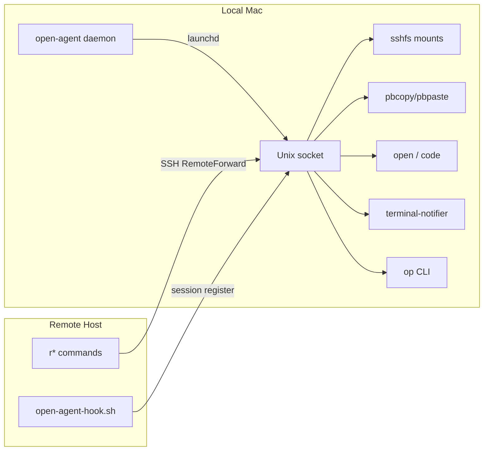

# Remote Workflow Guide

A toolkit for working seamlessly across SSH sessions: open files on your local Mac, share clipboards, transfer files, access 1Password secrets, browse projects, and launch editors — all from any remote host.

## Architecture Overview



- **open-agent** — A Deno daemon running on your local Mac. It listens on a Unix socket, manages SSHFS mounts, and executes local actions (open files, clipboard, notifications, 1Password).
- **SSH RemoteForward** — Forwards the agent's socket to `/tmp/open-agent.sock` on each remote host.
- **r\* commands** — Shell scripts installed on the remote. They send JSON messages to the forwarded socket.
- **open-agent-hook.sh** — Sourced in your remote shell profile. Registers/unregisters SSH sessions so the agent knows when to mount/unmount SSHFS.
- **rproj** — A project browser that runs on your local Mac. It discovers projects across multiple remote hosts and opens them via tmux, VS Code, or Finder.

## Prerequisites

### Local Mac

- **Deno** — `brew install deno` (runs the agent)
- **macFUSE + sshfs** — for SSHFS mounts
  ```bash
  brew install --cask macfuse
  brew install gromgit/fuse/sshfs-mac
  ```
- **socat** (recommended) — `brew install socat` (more reliable than `nc` for Unix sockets)
- **terminal-notifier** (optional) — `brew install terminal-notifier` (for `rnotify`)
- **1Password CLI** (optional) — for `rop` 1Password proxy
- **fzf** — `brew install fzf` (for `rproj` interactive selection)

### Remote Hosts

- **socat** or **nc** — at least one must be available (`brew install socat` or `apt install socat`)
- **python3** — required by `rpaste` and `rop` for JSON parsing
- **tmux** — for `rproj tmux` / `rtmux`

## Setup

### Step 1: Install open-agent on the Local Mac

Clone the open-agent project and run the installer:

```bash
cd ~/src/personal/open-agent
./install.sh
```

This will:
- Copy `agent.ts` to `~/.local/share/open-agent/`
- Create `~/.remote-mounts/` for SSHFS mount points
- Install and start a launchd daemon (`com.open-agent.daemon`)
- Verify the socket is live at `~/.local/share/open-agent/open-agent.sock`

To check if it's running later:

```bash
# Check the socket exists
ls -la ~/.local/share/open-agent/open-agent.sock

# Check launchd status
launchctl list | grep open-agent

# View logs
cat ~/.local/share/open-agent/agent.log
cat ~/.local/share/open-agent/launchd-stderr.log
```

### Step 2: Configure SSH

Add to `~/.ssh/config` on your local Mac for each remote host:

```ssh-config
Host workmbp
    HostName mfsembp02.home.lockney.net
    User thomas.lockney

    # Forward the agent socket to the remote machine
    RemoteForward /tmp/open-agent.sock ~/.local/share/open-agent/open-agent.sock

    # Clean up stale socket files from prior disconnected sessions
    StreamLocalBindUnlink yes

    # Keep connections alive to reduce SSHFS mount disruptions
    ServerAliveInterval 30
    ServerAliveCountMax 3
```

You can generate a starting point with `rproj setup` (see [rproj](#rproj) below).

**Important**: If you use SSH multiplexing (`ControlMaster`), the `RemoteForward` is only established on the **first** connection that creates the master socket. If you change SSH config, kill the existing master first:

```bash
ssh -O exit workmbp
```

### Step 3: Set Up Host Identity on Each Remote

The remote needs to know its SSH alias so the `r*` commands send the correct host identifier. There are three ways (checked in this order):

#### Option A: Identity file (recommended — no server config needed)

```bash
ssh workmbp 'mkdir -p ~/.config/open-agent && echo workmbp > ~/.config/open-agent/identity'
```

#### Option B: Environment variable via SSH `SetEnv`

Add to your local `~/.ssh/config`:

```ssh-config
Host workmbp
    SetEnv OPEN_AGENT_HOST=workmbp
```

Requires the remote sshd to accept it. Add to `/etc/ssh/sshd_config` on the remote:

```
AcceptEnv OPEN_AGENT_HOST
```

Then restart sshd.

#### Option C: Hostname fallback

If the SSH alias matches the remote's short hostname (`hostname -s`), no config is needed. The hook falls back to `$(hostname -s)` automatically.

### Step 4: Deploy Remote Scripts

The `r*` commands and hook are managed as yadm dotfiles. On the remote host, either:

- **Use yadm** to clone and apply the dotfiles, or
- **Copy manually**:
  ```bash
  # From local Mac
  scp bin/ropen bin/rcopy bin/rpaste bin/rpush bin/rpull bin/rnotify bin/rop bin/rcode workmbp:~/bin/
  scp .config/open-agent-hook.sh workmbp:~/.config/open-agent-hook.sh
  ```

### Step 5: Source the Hook on the Remote

Add to `~/.zshrc` (or `~/.bashrc`) on each remote host:

```bash
# open-agent: register SSH sessions for SSHFS mount lifecycle
[[ -f ~/.config/open-agent-hook.sh ]] && source ~/.config/open-agent-hook.sh
```

The hook:
- Only activates inside SSH sessions (`$SSH_CONNECTION` must be set)
- Registers the session with the local agent on shell startup (triggers SSHFS mount)
- Unregisters on shell exit (triggers unmount after 30s grace period)
- Aliases `open` to `ropen` if available

### Step 6: Test the Connection

Start a new SSH session and verify:

```bash
ssh workmbp

# Check the socket is forwarded
ls -la /tmp/open-agent.sock

# Check agent status
oa-status

# Test opening a file
ropen ~/.zshrc
```

## Remote Commands Reference

All `r*` commands run on the **remote host** and communicate with the local open-agent via the forwarded socket at `/tmp/open-agent.sock`.

### ropen

Open files, URLs, or VS Code projects on your local Mac.

```bash
ropen README.md                      # Open with default app on local Mac
ropen -a "Marked 2" doc.md           # Open with a specific application
ropen -v ~/projects/myapp            # Open folder in local VS Code via remote-ssh
ropen https://github.com/foo/bar     # Open URL in local browser
```

When the agent socket isn't available, `ropen` falls back to the native `open` command (if on macOS).

The hook automatically aliases `open` to `ropen` in SSH sessions, so `open file.md` works transparently.

### rcopy / rpaste

Share your clipboard between remote and local machines.

```bash
# Copy to local clipboard
echo "some text" | rcopy
cat file.txt | rcopy
git diff | rcopy

# Paste from local clipboard
rpaste
rpaste > file.txt
rpaste | vim -
```

### rpush / rpull

Transfer files between remote and local machines.

```bash
# Push a remote file to the local Mac
rpush build.tar.gz                   # → local ~/Downloads/build.tar.gz
rpush -d ~/Desktop report.pdf        # → local ~/Desktop/report.pdf

# Pull a local file to the remote machine
rpull ~/Downloads/image.png          # → ./image.png (current directory)
rpull ~/Desktop/notes.md ~/docs/     # → ~/docs/notes.md
```

### rnotify

Send macOS notifications from the remote host.

```bash
rnotify "Build complete"
rnotify "CI" "All 42 tests passed"
rnotify -s Ping "Deploy" "Production deploy finished"
rnotify -u "myproject" "Tests" "Suite passed in 3m12s"
```

Options:
- `-s <sound>` — Play a sound (e.g., `Ping`, `Glass`, `Hero`)
- `-u <subtitle>` — Add a subtitle

### rop

Proxy 1Password CLI operations to your local Mac (where the 1Password GUI and biometric auth are available).

```bash
# Read a single secret
rop read "op://dev/database/url"

# Run a command with op:// references resolved from env files
rop run --env-file .env -- make deploy
rop run --env-file .env --env-file .env.local -- terraform apply

# Run a command resolving op:// values from the current environment
rop run -- command-that-needs-secrets
```

The `run` subcommand:
1. Scans `--env-file` files and the current environment for `op://` references
2. Resolves them in parallel via the local 1Password CLI
3. Exports the resolved values and runs your command

### rcode

Open a project in VS Code. Context-aware:

- **On the remote**: delegates to `ropen -v` (sends through the agent socket)
- **On the local Mac**: delegates to `rproj code` (interactive project selection)

```bash
rcode                    # Interactive project selection (local) or current dir (remote)
rcode ~/projects/myapp   # Open specific path
```

### rtmux

Thin wrapper that delegates to `rproj tmux`. Opens a tmux session on a remote host for a selected project.

```bash
rtmux                    # Interactive project + host selection
rtmux myproject          # Direct to 'myproject'
```

## rproj

`rproj` is a local Mac command for browsing and opening projects across multiple remote hosts. It supports interactive selection via fzf and direct commands.

### Multi-Host Configuration

Create `~/.config/rproj/hosts` with one entry per line. Format: `alias|directory|label`

```
# ~/.config/rproj/hosts
workmbp|/Users/thomas.lockney/src/metron|Work (Metron)
workmbp|/Users/thomas.lockney/src/personal|Work (Personal)
devbox|~/projects|Dev Server
```

- **alias** — SSH host alias (must match your `~/.ssh/config`)
- **directory** — Remote directory containing projects (each subdirectory is a project)
- **label** — Display label in the fzf picker (optional, defaults to alias)

A host can appear multiple times with different directories. Each entry becomes a separate group in the picker.

**Backward compatibility**: If `hosts` doesn't exist, `rproj` falls back to the legacy `~/.config/rproj/config` file:

```bash
RPROJ_HOST="workmbp"
RPROJ_DIR="/Users/thomas.lockney/src/metron"
```

### Commands

#### Interactive mode (default)

```bash
rproj
```

1. Discovers projects from all configured hosts in parallel (3s SSH timeout per host)
2. Shows a unified fzf picker grouped by label:
   ```
   Work (Metron) > 📂 metron
   Work (Metron) >   ├── api-service
   Work (Metron) >   └── shared-libs
   Work (Personal) > 📂 personal
   Work (Personal) >   ├── open-agent
   Work (Personal) >   └── dotfiles
   ```
3. After selecting a project, choose an action: `tmux`, `code`, or `finder`

Type across the `>` separator to fuzzy-match on label + project name (e.g., "dev ml" narrows to `Dev Server > ml-pipeline`).

#### list

```bash
rproj list                  # List all projects from all hosts
rproj l                     # Short form
rproj list -h workmbp       # Filter to a specific host
rproj list --json           # Alfred-compatible JSON output
rproj list --json -q api    # Filtered JSON output
```

#### tmux

```bash
rproj tmux                         # Interactive selection, then SSH + tmux
rproj t                            # Short form
rproj tmux -h workmbp myproject    # Direct: open tmux for 'myproject' on workmbp
```

SSHes to the selected host, `cd`s into the project, and runs `tc` (create-or-attach tmux session named after the directory).

#### code

```bash
rproj code                         # Interactive selection, then open VS Code
rproj c                            # Short form
rproj code -h workmbp myproject    # Direct: open 'myproject' in VS Code
```

Opens the project in VS Code using `code --remote ssh-remote+<host> <path>`.

#### finder

```bash
rproj finder                       # Interactive selection, then open in Finder
rproj f                            # Short form
rproj finder -h workmbp myproject  # Direct
```

Opens the project directory in Finder via SSHFS. Requires open-agent to be running.

#### setup

```bash
rproj setup
```

Prints recommended SSH config and identity file commands for all configured hosts. Informational only — doesn't modify any files.

#### status

```bash
rproj status
rproj s
```

Shows open-agent daemon status (active mounts, sessions, version).

#### open

```bash
rproj open "workmbp|/Users/thomas.lockney/src/metron/api-service"
```

Opens a project in VS Code from a `host|path` argument. Used by Alfred integration.

### Options

| Option | Description |
|--------|-------------|
| `-h`, `--host HOST` | Filter to a specific host alias |
| `-p NAME` | Project name (skip interactive selection) |
| `--json` | Output as Alfred-compatible JSON (list only) |
| `-q QUERY` | Filter by query string (list --json only) |

When using `-p` with multiple hosts configured, `--host` is required to disambiguate.

## Troubleshooting

### Socket not found on remote

```
ropen: agent socket not found at /tmp/open-agent.sock
```

1. **Check the agent is running locally**: `ls -la ~/.local/share/open-agent/open-agent.sock`
2. **Check SSH forwarding**: `ssh -v workmbp` — look for `Requesting forwarding of remote forward`
3. **Kill stale multiplexed connections**: `ssh -O exit workmbp` then reconnect
4. **Check `RemoteForward` is in your SSH config** for this host

### SSHFS mount failures

```bash
# Check agent logs
cat ~/.local/share/open-agent/agent.log

# Verify sshfs is installed
which sshfs

# Check existing mounts
mount | grep remote-mounts

# Force unmount a stuck mount
diskutil unmount force ~/.remote-mounts/workmbp
```

### Host identity not set

If the agent receives the wrong host identifier, SSHFS mounts will target the wrong machine.

```bash
# On the remote, check what identity the hook resolved
echo $_OA_HOST

# If wrong, create/update the identity file
echo workmbp > ~/.config/open-agent/identity
```

### open-agent not starting

```bash
# Check launchd status
launchctl list | grep open-agent

# View error logs
cat ~/.local/share/open-agent/launchd-stderr.log

# Restart manually
launchctl bootout gui/$(id -u)/com.open-agent.daemon
launchctl bootstrap gui/$(id -u) ~/Library/LaunchAgents/com.open-agent.daemon.plist
```

### Offline hosts in rproj

If a host is unreachable, `rproj` skips it after a 3-second SSH timeout. Projects from reachable hosts still appear normally. No error is shown — the offline host's group is simply absent from the list.
